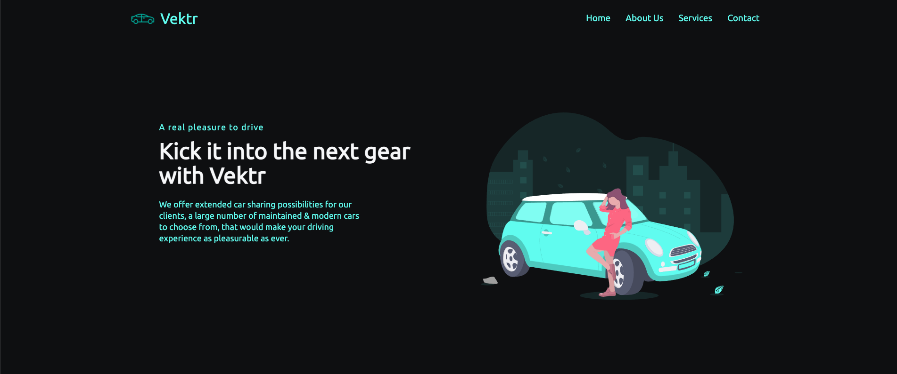

# Vektr

## Car sharing web application, developed with GatbsyJS

In this project, I have created a presentation website for a car sharing business called Vektr, using GatsbyJS for generating a static website. The structure of this project allows changing the displayed data without having the need for it to be stored in a CMS, making it very easy to adapt and change the business behind the website. 

The live demo for this application can be found here: https://fromzerotocicero-vektr.netlify.app/.

## License

This project is licensed under the MIT License - see the LICENSE.md file for details.

## Acknowledgments

Inspiration and code snippets have been used from:
* [Gatsby Documentation](https://www.gatsbyjs.com/docs/)
* [Brian Design React Website using styled components](https://www.youtube.com/watch?v=iP_HqoCuRI0&t=187s)
